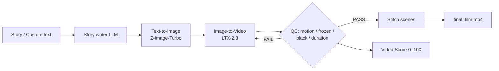

# 🎬 Automated Video Making — Offline Models

> **Turn a text prompt into a finished video — 100% on your own machine. No cloud APIs, no credits, no uploads.**

A fully-local, AI-powered **film pipeline** ("director mode") that drives **ComfyUI** end-to-end:

**Text story → keyframe images (Z-Image-Turbo) → animated clips (LTX-2.3) → automatic quality control → auto re-shoots → stitched final film — all through a web dashboard.**

---

## ✨ Key features

- **Fully offline** — everything runs through local ComfyUI + Ollama / OpenAI-compatible server. Your content never leaves your PC.
- **Story writer** — auto-generates multi-scene stories from a genre prompt via a local LLM, or use your own custom story file to bypass the AI entirely.
- **End-to-end automation** — T2I keyframe → I2V animation → per-scene **QC (pass/fail)** → automatic **re-shoot on failure** with new seeds → **stitch** into a final film.
- **Quality Control built in** — checks duration, black frames, frozen frames, and motion; re-shoots any scene that fails (configurable thresholds).
- **🎥 Video Score** — a built-in analyzer (`video_score.py`) that scores every clip **0–100** across motion, temporal consistency, frozen/black frames, sharpness, and exposure, with a letter grade — so you can see how well the pipeline performed.
- **Web control room** — a browser dashboard to edit all settings, write/upload a custom story, watch live console output, review QC results, play the film, and run/stop the pipeline.
- **GPU-friendly & testable** — ships with a **mock ComfyUI server** so the whole pipeline can be tested with **no GPU**.

---

## 🧠 How it works



The orchestrator is a plain Python app that talks to ComfyUI's HTTP API — because a node graph cannot run QC loops, the *director* is a Python app driving ComfyUI (the industry-standard approach).

---

## 📁 Repository layout

| Path | Purpose |
|------|---------|
| `director/` | The main Python app (orchestrator + dashboard). |
| `director/director.py` | The Director orchestrator — main entry point. |
| `director/storywriter.py` | Story generation: custom story → LLM → template fallback. |
| `director/qc.py` | Quality Control: duration, black/frozen frames, motion. |
| `director/video_score.py` | 0–100 "film score" analyzer (motion, flicker, sharpness, exposure…). |
| `director/comfy_api.py` | Minimal ComfyUI HTTP client (submit / poll / download). |
| `director/dashboard.html` + `dashboard_server.py` | Web control-room UI + controller server. |
| `director/narrate.py` | Optional offline narration post-processor (edge-tts). |
| `director/workflow_scene_template.json` | **Generated** 50-node scene graph (T2I → I2V → SaveVideo). |
| `director/workflow_knobs.json` | **Generated** mapping of the template "knobs". |
| `director/build_workflow.py` | Regenerates the template/knobs from the source workflow. |
| `director/config.json` | All settings (ComfyUI, LLM, scenes, seconds, QC thresholds). |
| `director/tests/` | Mock ComfyUI server + configs for **GPU-free** end-to-end tests. |
| `Text to Image and Image to Video.json` | The original source ComfyUI workflow (untouched). |
| `Story to Video - Director (T2I to I2V).json` | Generated workflow copy with director prompt nodes. |
| `build_director_workflow.py` / `validate_director_workflow.py` | Workflow generator / link-consistency validator. |

---

## 🚀 Quick start

### 1. Requirements
- **ComfyUI Desktop** running with the API enabled (`http://127.0.0.1:8188`).
- The models used by the workflow (already present if the workflow runs):
  - **T2I:** `z_image_turbo_int8_convrot.safetensors`, `qwen_3_4b_fp8_mixed.safetensors`, `ae.safetensors`
  - **I2V:** `ltx-2.3-22b-dev-fp8.safetensors`, `gemma_3_12B_it_fp4_mixed_2.safetensors`, `ltx-2.3-spatial-upscaler-x2-1.1.safetensors`, distilled LoRA
- **Python 3.10+**

### 2. Install
```bash
cd director
pip install -r requirements.txt
```

### 3. Run
```bash
cd director
python director.py --check      # verify ComfyUI + all models (no render)
python director.py              # full production run
```
Or launch the control room:
```bash
python director/dashboard_server.py --open
# → http://127.0.0.1:8765
```

### 4. Score the output
```bash
python director/video_score.py --dir director/output   # scores all clips + film
```

---

## 🛠️ Configuration (`director/config.json`)

Everything is editable — from the dashboard or the file:

- `story` — genre, **number of scenes** (1–30), **seconds per scene** (1–60), global character, custom story file.
- `llm` — backend (ollama / openai-compatible / none), model, retries.
- `render` — resolution, fps, camera move, LTX two-pass quality sigmas.
- `qc` — pass/fail thresholds (duration, black %, frozen %, min motion) and max re-shoot attempts.
- `audio` — optional edge-tts narration + subtitles.

> **Tip:** per-scene duration is always taken from `story.seconds_per_scene` — the dashboard setting is authoritative.

---

## 📝 Notes & disclaimer

- Renders are done on your local GPU. **Long scenes** (e.g. 25s @ 25fps ≈ 626 frames) are very heavy for a 12 GB GPU — LTX-2.3 is most stable around **5–8s per scene**.
- The bundled models are third-party checkpoints; please follow their individual licenses.
- Generated clips land in `director/output/` (git-ignored).
